# Data Structure

```mermaid
erDiagram
    APPLICATIONUSER {
        string Id PK
        string UserName
        string Email
        string AvatarUrl
        string SelfIntroduction
        string Gender
        datetime BirthDate
        datetime RegisteredAt
    }

    CONVERSATION {
        guid Id PK
    }

    MESSAGE {
        guid Id PK
        string SenderId FK
        string ReceiverId FK
        guid ConversationId FK
        datetime SentTime
        bool IsRead
    }

    NOTIFICATION {
        guid Id PK
        string UserId FK
        string Type
        bool IsRead
    }

    VISITLOG {
        int Id PK
        string UserId FK
        datetime VisitTime
    }

    DAILYSUMMARY {
        int Id PK
        date Date
    }

    FAVORITE {
        guid Id PK
        string UserId FK
        string Type
        string Name
    }

    GROUPENTITY {
        guid GroupId PK
        string Type
        string CreatedByUserId
        datetime CreatedAt
        datetime UpdatedAt
    }

    STUDYGROUPENTITY {
        guid GroupId PK
        string Name
        string Visibility
        string JoinPolicy
    }

    COHORTENTITY {
        guid GroupId PK
        guid StudyGroupStudyPlanId FK
        guid StudyPlanVersionId FK
        string EnrollmentPolicy
        string Status
        datetime StartAt
        datetime EndAt
        string Title
        string Visibility
    }

    USERGROUPENTITY {
        string UserId PK
        guid GroupId PK
        string Role
        string Status
        datetime JoinedAt
    }

    STUDYGROUPSTUDYPLAN {
        guid Id PK
        guid StudyGroupId FK
        guid StudyPlanStableId
        guid PlanVersionId
        string RelationType
        string Permission
    }

    GROUPPLANSWITCH {
        guid Id PK
        guid StudyGroupId FK
        guid PlanStableId
        guid ToVersionId
        datetime EffectiveAt
    }

    STUDYPLANENTITY {
        guid Id PK
        guid StableId
        int VersionNumber
        string Title
        guid CreatorId
    }

    LESSONENTITY {
        guid Id PK
        guid StableId
        int VersionNumber
        guid StudyPlanId FK
        string Title
    }

    STUDYPLANLESSONSNAPSHOT {
        guid StudyPlanStableId PK
        int StudyPlanVersionNumber PK
        guid LessonStableId PK
        int LessonVersionNumber PK
        string StepType
        int StepOrder
    }



    STUDYPLANUSERROLE {
        guid PlanStableId PK
        string UserId PK
        string Role
    }

    KNOWLEDGENODE {
        guid Id PK
        guid StableId
        int VersionNumber
        guid DefaultL10nSetId FK
    }

    TAGS {
        guid Id PK
        guid StableId
        int VersionNumber
        guid DefaultL10nSetId FK
    }

    TYPESOFTAGS {
        int Id PK
        string Type
    }

    TAGTYPES {
        guid TagStableId PK
        int TypeId
    }

    TAGREPRESENTATIVENODE {
        guid TagId PK
        guid NodeId PK
    }

    RESOURCE {
        guid Id PK
        string Link
        string Name
    }

    L10NSET {
        guid L10nSetId PK
        string Scope
    }

    L10NITEM {
        guid L10nItemId PK
        string FieldKey
        string LangCode
        string Text
    }

    NODEL10NSET {
        guid NodeId PK
        guid L10nSetId PK
        int Relation
    }

    L10NSETITEM {
        guid L10nSetId PK
        guid L10nItemId PK
    }

    TAGL10NSET {
        guid TagId PK
        guid L10nSetId PK
        int Relation
    }

    APPLICATIONUSER ||--o{ MESSAGE : sender
    APPLICATIONUSER ||--o{ MESSAGE : receiver
    CONVERSATION ||--o{ MESSAGE : messages
    APPLICATIONUSER ||--o{ NOTIFICATION : user
    APPLICATIONUSER ||--o{ VISITLOG : user
    APPLICATIONUSER ||--o{ FAVORITE : favorites
    APPLICATIONUSER ||--o{ USERGROUPENTITY : memberships
    APPLICATIONUSER ||--o{ STUDYPLANUSERROLE : plan_roles
    GROUPENTITY ||--|| STUDYGROUPENTITY : flavor
    GROUPENTITY ||--|| COHORTENTITY : flavor
    GROUPENTITY ||--o{ USERGROUPENTITY : members
    GROUPENTITY ||--o{ STUDYGROUPSTUDYPLAN : plan_bindings

    STUDYGROUPENTITY ||--o{ STUDYGROUPSTUDYPLAN : plans
    STUDYGROUPENTITY ||--o{ GROUPPLANSWITCH : plan_switches
    STUDYGROUPSTUDYPLAN ||--o{ COHORTENTITY : cohorts

    STUDYPLANENTITY ||--o{ LESSONENTITY : lessons
    STUDYPLANENTITY ||--o{ STUDYPLANLESSONSNAPSHOT : lesson_snapshot
    STUDYPLANENTITY ||--o{ STUDYPLANUSERROLE : user_roles
    STUDYPLANENTITY ||--o{ STUDYGROUPSTUDYPLAN : group_binding
    STUDYPLANENTITY ||--o{ COHORTENTITY : cohort_version

    LESSONENTITY ||--o{ STUDYPLANLESSONSNAPSHOT : snapshot

    TAGS ||--o{ TAGL10NSET : l10n
    TAGS ||--o{ TAGREPRESENTATIVENODE : representative
    TAGS ||--o{ TAGTYPES : type_map
    TYPESOFTAGS ||--o{ TAGTYPES : type

    KNOWLEDGENODE ||--o{ NODEL10NSET : l10n
    KNOWLEDGENODE ||--o{ TAGREPRESENTATIVENODE : representative

    L10NSET ||--o{ NODEL10NSET : nodes
    L10NSET ||--o{ TAGL10NSET : tags
    L10NSET ||--o{ L10NSETITEM : items
    L10NITEM ||--o{ L10NSETITEM : items
    L10NSET ||--o| KNOWLEDGENODE : default
    L10NSET ||--o| TAGS : default
```

Notes:
- Identity tables (AspNetRoles, AspNetUserRoles, AspNetUserClaims, etc.) live in the Users schema and are not expanded here.
- Some links use stable ids (StudyPlanStableId, TagStableId, LessonStableId) and are modeled as logical relations even when an explicit FK is not configured.
- Plan enrollment is group-level. Personal plans use UserGroups membership + StudyPlans.GroupPlanEnrollments. Cohort plans use UserGroups membership + StudyGroups.Cohorts. StudyGroups.StudyGroupStudyPlans is the stable study-group adoption/catalog relation.
- Lesson tag relations are stored in Neo4j via `(:Tag)-[:TAGGED_WITH]->(:Lesson)`.
